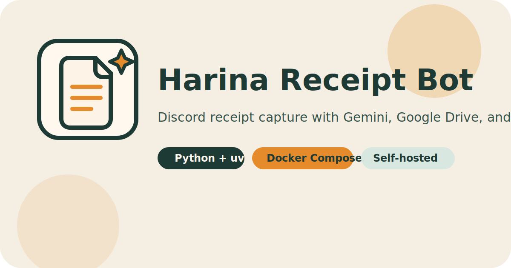

<div align="center">
  
  <h1>Harina Receipt Bot</h1>
  <p>Discord のレシート運用を Gemini、Google Drive、Google Sheets、そして移行用データセット作成までつなぐ Python ツールです。</p>
</div>

[English](./README.md)


## ✨ 概要

Harina Receipt Bot は、レシート運用向けのセルフホスト型 Python Discord bot です。役割は大きく 2 つあります。

- Discord に投稿されたレシート画像を常時処理し、Gemini、Google Drive、Google Sheets へ連携する
- V1、V2、V3 からの移行や、モデル更新後の再スキャン用に過去画像をデータセットとして取得する

## 🚀 特長

- Discord チャンネルに投稿されたレシート画像を監視
- Gemini で店舗名、日付、金額、税額、支払方法、OCR 風テキスト、明細行を構造化
- 元画像を Google Drive に保存
- 1 レシートごとに Google Sheets へ 1 行追加
- 過去の Discord 画像をローカルデータセットとして取得できる
- `uv` と Docker Compose でローカル運用しやすい

## 🔄 想定ワークフロー

1. 日常運用: ユーザーが Discord にレシート画像を投稿し、bot が自動処理する
2. データ移行: V1、V2、V3 のチャンネルから過去画像をまとめて取得する
3. 再スキャン: プロンプト、モデル、スキーマ、抽出ロジックの変更後に旧データを再評価する

## ⚡ クイックスタート

```bash
cp .env.example .env
uv sync
uv run pytest
uv run python -m app.main
```

必須の環境変数:

- `DISCORD_TOKEN`
- `GEMINI_API_KEY`
- `GOOGLE_DRIVE_FOLDER_ID`
- `GOOGLE_SHEETS_SPREADSHEET_ID`
- `GOOGLE_SERVICE_ACCOUNT_JSON` または `GOOGLE_SERVICE_ACCOUNT_KEY_FILE`

## 📦 データセットダウンローダー

移行や再スキャン用に、Discord の画像を一括取得するワンショット CLI としても使えます。

```bash
uv run python -m app.dataset_downloader "https://discord.com/channels/<guild_id>/<channel_id>"
```

よく使う例:

```bash
uv run python -m app.dataset_downloader "https://discord.com/channels/<guild_id>/<channel_id>" --limit 5
uv run python -m app.dataset_downloader "https://discord.com/channels/<guild_id>/<channel_id>" --output-dir ./dataset/v3-backfill
uv run python -m app.dataset_downloader "https://discord.com/channels/<guild_id>/<channel_id>" --overwrite
```

主なオプション:

- `--output-dir ./dataset/discord-images`
- `--limit 500`
- `--include-bots`
- `--overwrite`

アップロードされていたファイル名はそのまま保持されます。保存先は `guild-<name-or-id>/channel-<name-or-id>/message-<id>/attachment-<id>/` で整理され、ルートには `metadata.jsonl` を出力します。サーバー名またはチャンネル名に日本語が含まれる場合は、その名前部分をスキップして数値 ID のみを使います。

主な用途:

- V1、V2、V3 からの過去データ移行
- 回帰検証や評価用の固定データセット作成
- Gemini モデルやプロンプト更新後の再スキャン

bot 側の前提条件:

- 対象サーバーに bot が参加していること
- 対象チャンネルの閲覧権限と履歴参照権限があること
- Discord Developer Portal で `MESSAGE CONTENT INTENT` を有効化していること

## 🐳 Docker Compose

```bash
docker compose up -d --build
docker compose logs -f
```

Google サービスアカウント JSON ファイルを使う場合は `./secrets` に置き、`GOOGLE_SERVICE_ACCOUNT_KEY_FILE=/app/secrets/your-key.json` を設定してください。

## 📚 ドキュメント

- [Docs site](https://sunwood-ai-labs.github.io/harina-v4/)
- [概要](./docs/ja/guide/overview.md)
- [データセットダウンローダー](./docs/ja/guide/dataset-downloader.md)
- [Google 設定](./docs/ja/guide/google-setup.md)
- [デプロイ](./docs/ja/guide/deployment.md)

## 🗂 リポジトリ構成

```text
app/                  Python bot 実装
docs/                 VitePress ドキュメント
.github/workflows/    CI と GitHub Pages
Dockerfile            コンテナイメージ定義
docker-compose.yml    セルフホスト用構成
```

## 🛠 運用メモ

- `DISCORD_CHANNEL_IDS` を空にすると、アクセス可能な全チャンネルを対象にします
- `DISCORD_CHANNEL_IDS` にカンマ区切りの ID を入れると対象を制限できます
- bot 起動時に Google Sheets のヘッダー行を自動作成します
- 必須設定が不足している場合は起動時に失敗します
- `DISCORD_DATASET_OUTPUT_DIR` で downloader の既定保存先を変更できます

## 💻 開発

```bash
uv sync
uv run pytest
npm --prefix docs install
npm --prefix docs run docs:build
```

## 📄 ライセンス

[MIT](./LICENSE)
