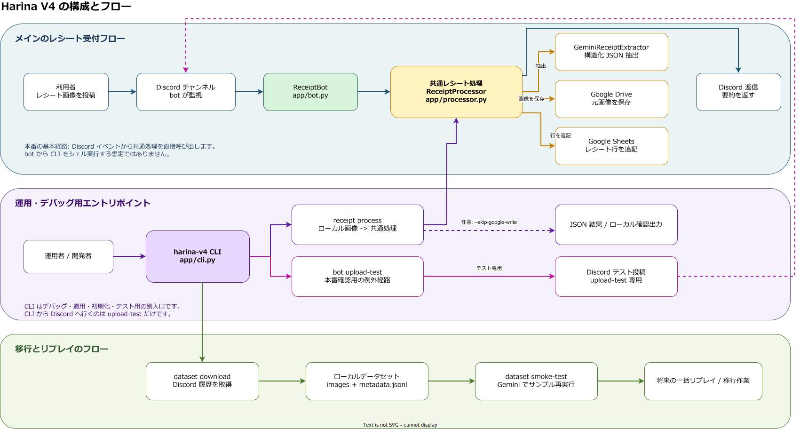

<div align="center">
  
  <h1>Harina Receipt Bot</h1>
  <p>Discord と Google Drive を入口にして、Gemini・Google Drive・Google Sheets へつなぐレシート自動化ツールです。</p>
</div>

[English](./README.md)


## 概要

Harina Receipt Bot は、レシート処理を自前で回したい人向けの Python 製自動化スタックです。  
入口は 2 つあります。

- Discord に画像を直接投稿して bot に処理させる
- Google Drive の監視フォルダに画像を置き、watcher が Discord に通知しながら同じ処理系へ流す

各レシートは Gemini の 2 段階処理で扱います。

1. 画像から店舗、金額、明細を抽出
2. Google Sheets のカテゴリ一覧を使って、各商品に 1 つずつカテゴリを付与

## できること

- Gemini で店舗名、日付、金額、税額、支払方法、OCR 風テキスト、明細行を抽出
- 毎回 `Categories` シートを読んで承認済みカテゴリ一覧を Gemini に渡す
- `野菜`、`惣菜`、`飲料` のような短い一語カテゴリに正規化する
- 既存カテゴリに合わない場合は Gemini が新カテゴリを提案し、`Categories` に追記する
- 元画像を Google Drive に保存
- Google Sheets に商品ごとの 1 行を書き込み、`itemCategory` も保存する
- Google Drive の新着画像を Discord 通知チャンネルへ転送
- Discord 返信でカテゴリ要約、商品ごとのカテゴリ、金額つき明細を表示
- 処理済みファイルを別フォルダへ移動
- `uv` でも Docker Compose でも運用可能

## 主な使い方

1. Discord 受付: 指定チャンネルへ画像を投稿すると、bot が処理してカテゴリ付きで返信します。
2. Drive 受付: 監視元フォルダへ画像を置くと、watcher が Discord 通知、Sheets の商品行記録、processed フォルダ移動まで実行します。
3. バックフィル: 過去の Discord 画像を dataset として落として、Gemini の再評価や移行検証に使えます。

## アーキテクチャ



元データ: [docs/architecture/harina-v4-flow.ja.drawio](./docs/architecture/harina-v4-flow.ja.drawio)

## クイックスタート

```bash
cp .env.example .env
uv sync
uv run pytest
uv run harina-v4 google oauth-login --oauth-client-secret-file ./secrets/harina-oauth-client.json --env-file .env
uv run harina-v4 google init-resources --env-file .env
uv run harina-v4 google init-drive-watch --env-file .env
uv run harina-v4 bot run
```

bot 側で最低限必要な環境変数:

- `DISCORD_TOKEN`
- `GEMINI_API_KEY`
- `GOOGLE_SHEETS_SPREADSHEET_ID`
- `GOOGLE_SHEETS_CATEGORY_SHEET_NAME` 任意、既定値は `Categories`
- `GOOGLE_SERVICE_ACCOUNT_JSON` または `GOOGLE_SERVICE_ACCOUNT_KEY_FILE`
- または `GOOGLE_OAUTH_CLIENT_JSON` / `GOOGLE_OAUTH_CLIENT_SECRET_FILE` と `GOOGLE_OAUTH_REFRESH_TOKEN`

Drive watcher 側で必要な環境変数:

- `DISCORD_NOTIFY_CHANNEL_ID`
- `GOOGLE_DRIVE_WATCH_SOURCE_FOLDER_ID`
- `GOOGLE_DRIVE_WATCH_PROCESSED_FOLDER_ID`
- `DRIVE_POLL_INTERVAL_SECONDS`

## CLI

```bash
uv run harina-v4 --help
```

主なコマンド:

```bash
uv run harina-v4 bot run
uv run harina-v4 bot upload-test --channel-id <channel_id> --image ./sample-receipt.jpg
uv run harina-v4 receipt process ./sample-receipt.jpg --skip-google-write
uv run harina-v4 google oauth-login --oauth-client-secret-file ./secrets/harina-oauth-client.json --env-file .env
uv run harina-v4 google init-resources --env-file .env
uv run harina-v4 google init-drive-watch --env-file .env
uv run harina-v4 drive watch --once
uv run harina-v4 dataset download "https://discord.com/channels/<guild_id>/<channel_id>" --limit 50
uv run harina-v4 dataset smoke-test --dataset-dir ./dataset/v3-backfill --limit 2
uv run harina-v4 test docs-public
```

## Google セットアップ

個人 Gmail で使うなら、基本的には OAuth refresh token 方式がおすすめです。  
一度ブラウザで同意すれば、その後は CLI から Drive / Sheets / watch 用フォルダをまとめて作れます。

```bash
uv run harina-v4 google oauth-login --oauth-client-secret-file ./secrets/harina-oauth-client.json --env-file .env
uv run harina-v4 google init-resources --env-file .env
uv run harina-v4 google init-drive-watch --env-file .env
```

`google init-drive-watch` で行うこと:

- 新着画像用の Drive inbox フォルダを作成または再利用
- 処理済みファイル用の Drive processed フォルダを作成または再利用
- フォルダ ID、URL、ポーリング秒数を `.env` に保存

便利なオプション:

- `--source-folder-name "Harina V4 Drive Inbox"`
- `--processed-folder-name "Harina V4 Drive Processed"`
- `--parent-folder-id <folder_id>`
- `--poll-interval-seconds 60`
- `--share-with-email you@example.com`
- `--env-file .env`

`google init-resources` では、Spreadsheet に次の 2 シートも保証します。

- `Receipts`: 商品ごとに 1 行ずつ保存する台帳
- `Categories`: Gemini に毎回渡すカテゴリ一覧

初期カテゴリは `野菜`、`肉`、`惣菜`、`飲料`、`手数料` などの一語ラベルです。  
既存カテゴリに当てはまらない場合は、Gemini が短い新カテゴリ名を提案し、HARINA が `Categories` に追加できます。

## カテゴリ処理の流れ

1. Stage 1 で画像から正規化済みレシート情報と明細を抽出
2. Stage 2 で `Categories` シートを読んで、各商品にカテゴリを付与
3. 既存カテゴリに合わない場合は短い新カテゴリを提案
4. HARINA が新カテゴリを `Categories` に追記し、`Receipts` の `itemCategory` にも保存
5. Discord 返信ではカテゴリ要約に加えて `商品カテゴリ` 欄も出し、商品ごとの対応が分かるようにする

## Drive watcher の流れ

1. `GOOGLE_DRIVE_WATCH_SOURCE_FOLDER_ID` に画像をアップロード
2. `uv run harina-v4 drive watch --once` で単発確認、または watcher を常駐起動
3. HARINA が Drive 画像を取得し、抽出とカテゴリ付与を行い、Sheets に商品行を追記し、`DISCORD_NOTIFY_CHANNEL_ID` へ画像つき通知を送り、最後に `GOOGLE_DRIVE_WATCH_PROCESSED_FOLDER_ID` へ移動

## Docker Compose

```bash
docker compose up -d --build
docker compose logs -f receipt-bot
docker compose logs -f drive-watcher
```

Compose では 2 サービスが動きます。

- `receipt-bot`: Discord 直接投稿の受付
- `drive-watcher`: Google Drive inbox フォルダの監視

ファイルベースの Google 認証情報を使う場合は `./secrets` に置き、`GOOGLE_OAUTH_CLIENT_SECRET_FILE` または `GOOGLE_SERVICE_ACCOUNT_KEY_FILE` を `/app/secrets/...` に向けてください。

## ドキュメント

- [Docs site](https://sunwood-ai-labs.github.io/harina-v4/)
- [概要](./docs/ja/guide/overview.md)
- [CLI](./docs/ja/guide/cli.md)
- [Google セットアップ](./docs/ja/guide/google-setup.md)
- [デプロイ](./docs/ja/guide/deployment.md)
- [データセットダウンローダー](./docs/ja/guide/dataset-downloader.md)
- [Gemini スモークテスト](./docs/ja/guide/gemini-smoke-test.md)

## 開発

```bash
uv sync
uv run pytest
uv run harina-v4 --help
npm --prefix docs install
npm --prefix docs run docs:build
```

## ライセンス

[MIT](./LICENSE)
