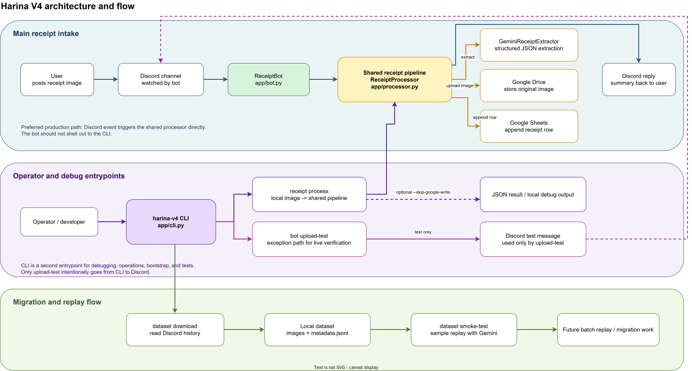

<div align="center">
  
  <h1>Harina Receipt Bot</h1>
  <p>Discord and Google Drive receipt intake for Gemini, Google Drive, and Google Sheets.</p>
</div>

[日本語](./README.ja.md)


## Overview

Harina Receipt Bot is a self-hosted Python automation stack for receipt workflows.
It supports two intake paths:

- direct Discord uploads processed by the always-on bot
- Google Drive uploads forwarded into Discord by a watcher service and then processed by the same pipeline

Each receipt goes through a two-stage Gemini pipeline:

1. extract merchant, totals, and line items from the image
2. assign one short bookkeeping category to each line item using a Google Sheets-backed category catalog

## Highlights

- Extract merchant, date, totals, tax, payment method, OCR-like text, and line items with Gemini
- Use a `Categories` sheet as the approved category list for every run
- Normalize categories to short single-word labels such as `野菜`, `惣菜`, and `飲料`
- Allow Gemini to suggest a new category when no existing option fits, then append it back into Sheets
- Store Discord-uploaded images in the main Google Drive archive under `YYYY/MM`
- Move Drive watcher source files into `YYYY/MM` folders inside each processed folder
- Append one bookkeeping row per line item into Google Sheets, including `itemCategory`
- Skip duplicate receipts when the same `attachmentName` is already recorded in Google Sheets, with `--rescan` available for intentional reprocessing
- Forward new Google Drive images into a Discord notification channel
- Reply in Discord with category summary, per-item categories, and priced line items
- Move processed Google Drive files into a separate folder after success
- Run locally with `uv` or continuously with Docker Compose

## Typical workflows

1. Discord intake: users upload receipt images to a watched Discord channel and the bot replies with a summary, category totals, and per-item categories.
2. Drive intake: users upload images to a Google Drive inbox folder and the watcher posts them into Discord, writes Sheets line-item rows, and moves them into a processed folder.
3. Backfill and replay: operators download historical Discord images into a local dataset and rerun Gemini checks after prompt or model changes.

## Duplicate attachment protection

- HARINA treats `attachmentName` as the primary key for receipt images across the receipt tabs in Google Sheets.
- Discord intake replies with `Receipt Skipped` instead of writing duplicate rows when the same filename is already recorded.
- `drive watch` skips duplicate filenames before Discord notification, avoids writing duplicate rows, and moves the duplicate file into the processed folder.
- `receipt process --rescan` and `drive watch --rescan` bypass the duplicate guard when you intentionally want a replay or backfill.
- If a Drive watcher run fails before processing completes, the file stays in the source folder so it can be retried safely.

## Architecture



Source: [docs/architecture/harina-v4-flow.drawio](./docs/architecture/harina-v4-flow.drawio)

## Quick start

```bash
cp .env.example .env
uv sync
uv run pytest
uv run harina-v4 google oauth-login --oauth-client-secret-file ./secrets/harina-oauth-client.json --env-file .env
uv run harina-v4 google init-resources --env-file .env
uv run harina-v4 google init-drive-watch --env-file .env
uv run harina-v4 bot run
```

Required environment variables for the bot:

- `DISCORD_TOKEN`
- `GEMINI_API_KEY`
- `GOOGLE_SHEETS_SPREADSHEET_ID`
- `GOOGLE_SHEETS_CATEGORY_SHEET_NAME` optional, defaults to `Categories`
- `GOOGLE_SERVICE_ACCOUNT_JSON` or `GOOGLE_SERVICE_ACCOUNT_KEY_FILE`
- or `GOOGLE_OAUTH_CLIENT_JSON` / `GOOGLE_OAUTH_CLIENT_SECRET_FILE` plus `GOOGLE_OAUTH_REFRESH_TOKEN`

Required environment variables for the Drive watcher:

- `DISCORD_NOTIFY_CHANNEL_ID`
- `GOOGLE_DRIVE_WATCH_SOURCE_FOLDER_ID`
- `GOOGLE_DRIVE_WATCH_PROCESSED_FOLDER_ID`
- `DRIVE_POLL_INTERVAL_SECONDS`

## CLI

```bash
uv run harina-v4 --help
```

Core commands:

```bash
uv run harina-v4 bot run
uv run harina-v4 bot upload-test --channel-id <channel_id> --image ./sample-receipt.jpg
uv run harina-v4 receipt process ./sample-receipt.jpg --skip-google-write
uv run harina-v4 receipt process ./sample-receipt.jpg --rescan
uv run harina-v4 google oauth-login --oauth-client-secret-file ./secrets/harina-oauth-client.json --env-file .env
uv run harina-v4 google init-resources --env-file .env
uv run harina-v4 google init-drive-watch --env-file .env
uv run harina-v4 drive watch --once
uv run harina-v4 drive watch --once --rescan
uv run harina-v4 dataset download "https://discord.com/channels/<guild_id>/<channel_id>" --limit 50
uv run harina-v4 dataset smoke-test --dataset-dir ./dataset/v3-backfill --limit 2
uv run harina-v4 test docs-public
```

## Google setup

Use OAuth refresh tokens for personal Gmail accounts whenever possible.
After the one-time browser login, HARINA can bootstrap both the receipt storage targets and the Drive watcher folders from the CLI.

```bash
uv run harina-v4 google oauth-login --oauth-client-secret-file ./secrets/harina-oauth-client.json --env-file .env
uv run harina-v4 google init-resources --env-file .env
uv run harina-v4 google init-drive-watch --env-file .env
```

`google init-drive-watch` creates or reuses:

- a Drive inbox folder for new uploads
- a Drive processed folder for files already handled
- optional `.env` entries for folder IDs, URLs, and poll interval

Useful flags:

- `--source-folder-name "Harina V4 Drive Inbox"`
- `--processed-folder-name "Harina V4 Drive Processed"`
- `--parent-folder-id <folder_id>`
- `--poll-interval-seconds 60`
- `--share-with-email you@example.com`
- `--env-file .env`

`google init-resources` also ensures two spreadsheet tabs:

- `Receipts` for one row per line item
- `Categories` for the approved category catalog that Gemini reads on every write-enabled run

The default category seed uses short single-word labels such as `野菜`, `肉`, `惣菜`, `飲料`, and `手数料`.
If Gemini returns a category that is not already in `Categories`, HARINA can append it automatically for future runs.

## Category workflow

1. Stage 1 extracts normalized receipt fields and line items from the image.
2. Stage 2 reads the current `Categories` sheet and asks Gemini to assign one category per line item.
3. If no existing category fits, Gemini may propose one short new category name.
4. HARINA appends any new category into `Categories` and writes `itemCategory` into the `Receipts` rows.
5. Discord replies show both a category summary and a `商品カテゴリ` section so each product-category pair is visible.

## Drive watcher flow

1. Upload an image into `GOOGLE_DRIVE_WATCH_SOURCE_FOLDER_ID`.
2. Run `uv run harina-v4 drive watch --once` for a one-shot check, or keep the watcher running continuously.
3. HARINA downloads the Drive image, runs extraction plus categorization, writes line-item rows into Sheets, posts the image into `DISCORD_NOTIFY_CHANNEL_ID`, and moves the original Drive file into `GOOGLE_DRIVE_WATCH_PROCESSED_FOLDER_ID/YYYY/MM`.
4. If the same filename is already recorded in Sheets, HARINA skips Discord notification and row writes, then moves the duplicate directly into the matching `YYYY/MM` processed folder.
5. If processing fails before completion, HARINA leaves the source file in place for a later retry.

## Docker Compose

```bash
docker compose up -d --build
docker compose logs -f receipt-bot
docker compose logs -f drive-watcher
```

The Compose stack runs two services:

- `receipt-bot` for direct Discord intake
- `drive-watcher` for polling the Google Drive inbox folder

If you use file-based Google credentials, place them under `./secrets` and point `GOOGLE_OAUTH_CLIENT_SECRET_FILE` or `GOOGLE_SERVICE_ACCOUNT_KEY_FILE` at the mounted `/app/secrets/...` path.

## Documentation

- [Docs site](https://sunwood-ai-labs.github.io/harina-v4/)
- [Overview](./docs/guide/overview.md)
- [CLI](./docs/guide/cli.md)
- [Google setup](./docs/guide/google-setup.md)
- [Deployment](./docs/guide/deployment.md)
- [Dataset Downloader](./docs/guide/dataset-downloader.md)
- [Gemini Smoke Test](./docs/guide/gemini-smoke-test.md)

## Development

```bash
uv sync
uv run pytest
uv run harina-v4 --help
npm --prefix docs install
npm --prefix docs run docs:build
```

## License

[MIT](./LICENSE)
